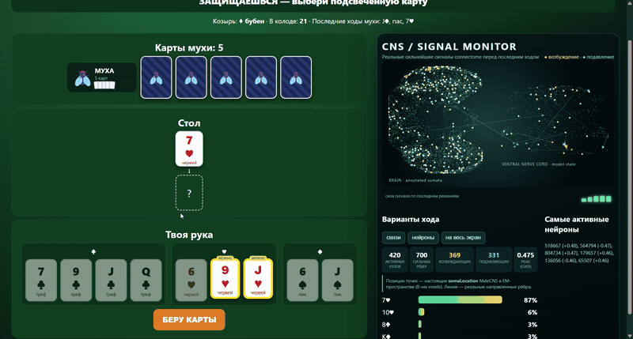

# FlyDurak

[English](README.md) | **Русский**

Опубликованный коннектом центральной нервной системы дрозофилы **MaleCNS**, превращённый в рекуррентную политику для игры в подкидного дурака один на один. В модели используются **165 122 нейрона и 10 511 038 направленных связей**, а во время хода интерфейс показывает сильнейшие нейронные сигналы.

> Это весёлый исследовательский проект, а не доказательство того, что муха понимает карты или что биологическая топология лучше обычных нейросетей.



## Запуск

Нужен только Python 3.11+. В папке репозитория:

```powershell
py run.py
```

На Linux и macOS: `python3 run.py`. Первый запуск сам создаст `.venv`, установит проект, скачает и соберёт MaleCNS, скачает и проверит checkpoint размером 374 МБ, выберет CUDA или CPU, найдёт свободный порт и откроет игру. Следующие запуски будут быстрыми.

Скачать репозиторий и запустить одной строкой в Windows PowerShell 5/7:

```powershell
git clone https://github.com/KremlevLev/flydurak.git; Set-Location flydurak; py run.py
```

URL нужно копировать как обычный текст, без Markdown-скобок `[...](...)`.

### Docker

```bash
docker compose up --build
```

После запуска откройте [http://localhost:8765](http://localhost:8765). Данные и веса сохраняются в `data/` и `models/`.

## Как обучали муху

MaleCNS преобразуется в знаковый нормализованный разреженный рекуррентный граф. Его состояние объединяется с компактным decision GRU, маской допустимых ходов, actor/critic-головами и факторизованными обучаемыми коэффициентами синапсов.

Агент обучался батчевым reinforcement learning против случайных и эвристических игроков, замороженных предыдущих политик и соперника с determinized search. Затем проводилось отдельное дообучение против поиска.

Интерфейс использует официальные soma-координаты MaleCNS и показывает сильные активации и направленные синаптические сигналы. В вычислении участвует полный граф; на экран выводится только читаемая выборка связей.

Текущий checkpoint способен обыгрывать людей, но не является идеальным решателем дурака. Полное сравнение с GRU/LSTM на нескольких seed пока не завершено.

## Параметры

```powershell
py run.py --device cpu
py run.py --device cuda
py run.py --port 9000
py run.py --no-browser
```

Подробнее: [архитектура](docs/ARCHITECTURE.md), [эксперименты](docs/EXPERIMENTS.md), [model card](docs/MODEL_CARD.md), [данные](data/README.md).

Код: [MIT](LICENSE). MaleCNS скачивается из исходного публичного источника и сохраняет собственные условия лицензии и атрибуции.
